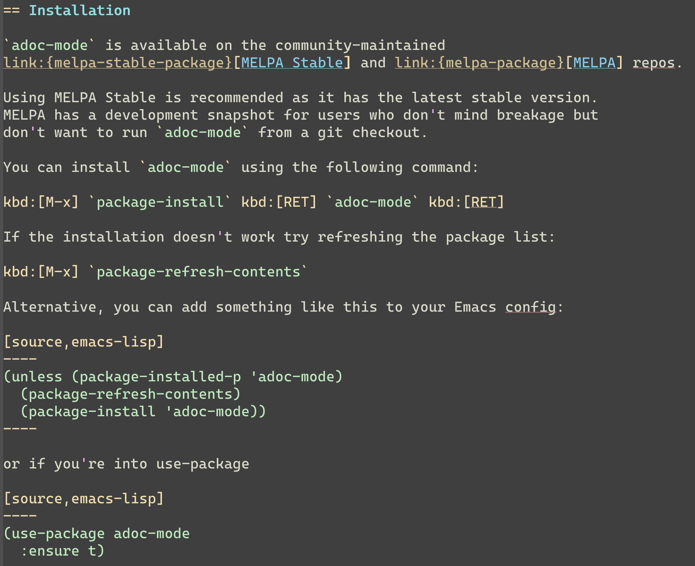

:experimental:
:highlighter: coderay
:melpa-badge: http://melpa.org/packages/adoc-mode-badge.svg
:melpa-stable-badge: http://stable.melpa.org/packages/adoc-mode-badge.svg
:melpa-package: http://melpa.org/#/adoc-mode
:melpa-stable-package: http://stable.melpa.org/#/adoc-mode
:melpa: http://melpa.org
:melpa-stable: http://stable.melpa.org
:license-badge: https://img.shields.io/badge/license-GPL_3-green.svg
:copying: http://www.gnu.org/copyleft/gpl.html

image:https://github.com/bbatsov/adoc-mode/workflows/CI/badge.svg[link="https://github.com/bbatsov/adoc-mode/actions?query=workflow%3ACI"]
image:{melpa-badge}[link="{melpa-package}"]
image:{melpa-stable-badge}[link="{melpa-stable-package}"]
image:{license-badge}[link="{copying}"]

= adoc-mode

== Introduction

https://asciidoc.org/[AsciiDoc] is a text document format for
writing short documents, articles, books and UNIX man pages. AsciiDoc files
can be translated to HTML and DocBook markups.

`adoc-mode` is an Emacs major mode for editing AsciiDoc files. It emphasizes on
the idea that the document is highlighted so it pretty much looks like the
final output. What must be bold is bold, what must be italic is italic etc.
Meta characters are naturally still visible, but in a faint way, so they can
be easily ignored.

== Features

Here are some of the main features of `adoc-mode`:

- sophisticated highlighting
- promote / demote title
- toggle title type between one line title and two line title
- adjust underline length of a two line title to match title text's length
- goto anchor defining a given id, default reading from xref at point
- support for outline (however only with the one-line title style)

=== Demo

The highlighting emphasizes on how the output will look like. _All_
characters are visible, however meta characters are displayed in a faint way.

== Installation

`adoc-mode` is available on the community-maintained
link:{melpa-stable-package}[MELPA Stable] and link:{melpa-package}[MELPA] repos.

Using MELPA Stable is recommended as it has the latest stable version.
MELPA has a development snapshot for users who don't mind breakage but
don't want to run `adoc-mode` from a git checkout.

You can install `adoc-mode` using the following command:

kbd:[M-x] `package-install` kbd:[RET] `adoc-mode` kbd:[RET]

If the installation doesn't work try refreshing the package list:

kbd:[M-x] `package-refresh-contents`

Alternative, you can add something like this to your Emacs config:

[source,emacs-lisp]
----
(unless (package-installed-p 'adoc-mode)
  (package-refresh-contents)
  (package-install 'adoc-mode))
----

or if you're into use-package

[source,emacs-lisp]
----
(use-package adoc-mode
  :ensure t)
----

== Configuration

* According to an old AsciiDoc manual, `.txt` is the standard file extension of
  AsciiDoc files. Add the following to your initialization file to open all
  `.txt` files with adoc-mode as major mode automatically: `(add-to-list
  'auto-mode-alist (cons "\\.txt\\'" 'adoc-mode))`.
  More recent conventions for AsciiDoc file extensions include `.adoc` and
  `.asciidoc`, these are associated with `adoc-mode` automatically.

* If your default face is a fixed pitch (monospace) face, but in AsciiDoc
  files you liked to have normal text with a variable pitch face,
  `buffer-face-mode` is for you: `(add-hook 'adoc-mode-hook (lambda()
  (buffer-face-mode t)))`

=== Coming features

The next features I plan to implement

- Demote / promote for list items
- Outline support also for two line titles
- Correctly highlighting backslash escapes

== Hacking

adoc-mode uses https://github.com/doublep/eldev[Eldev] for development, so
you should install the tool first.

The easiest and "purest" way to run adoc-mode is to execute:

    $ eldev emacs

This will start a separate Emacs process with adoc-mode and its
dependencies available, but _without_ your normal packages installed.
However, you can use `Eldev-local` to add some packages with
`(eldev-add-extra-dependencies 'emacs ...)` forms.  See Eldev
documentation for details.

Alternatively, if you want to load adoc-mode from source code in the Emacs
you use for editing:

- Generate autoloads file (that's done automatically when installing
via `package.el` but you'll have to do it manually in this case):

[source,shellsession]
----
$ eldev build :autoloads
----

- Add to your `.emacs`:

[source,emacs-lisp]
----
;; load adoc-mode from its source code
(add-to-list 'load-path "~/projects/adoc-mode")
(load "adoc-mode-autoloads" t t)
----

=== Changing the code

It's perfectly fine to load adoc-mode from `package.el` and then to start making
experiments by changing existing code and adding new code.

A very good workflow is to just open the source code you've cloned and start
evaluating the code you've altered/added with commands like `C-M-x`,
`eval-buffer` and so on.

Once you've evaluated the new code, you can invoke some interactive command that
uses it internally or open a Emacs Lisp REPL and experiment with it there. You
can open an Emacs Lisp REPL with `M-x ielm`.

You can also quickly evaluate some Emacs Lisp code in the minibuffer with `M-:`.

=== Running the tests

Run all tests with:

[source,shellsession]
----
$ eldev test
----

NOTE: Tests may not run correctly inside Emacs' `shell-mode` buffers. Running
them in a terminal is recommended.

You can also check for compliance with a variety of coding standards in batch mode (including docstrings):

[source,shellsession]
----
$ eldev lint
----

To check for byte-compilation warnings you can just compile the project with Eldev:

[source,shellsession]
----
$ eldev compile
----

== History

`adoc-mode` was created by https://github.com/sensorflo/[Florian Kaufmann] in 2009. Eventually the development
was halted in 2016 and the mode was dormant for the next 6 years. In 2022
https://github.com/TobiasZawada[Tobias Zawada] encouraged the Emacs community to revive the development and after a brief period under the https://github.com/emacsorphanage[Emacs Orphanage] org, https://github.com/bbatsov/[Bozhidar Batsov] assumed the project's maintenance.

These days all upstream packages (e.g. on MELPA) are build from Bozhidar's fork.

== License

Copyright © 2009-2016 Florian Kaufmann

Copyright © 2022-2023 Bozhidar Batsov and `adoc-mode` contributors

Distributed under the link:{copying}[GNU General Public License]; type kbd:[C-h] kbd:[C-c] to view it.
